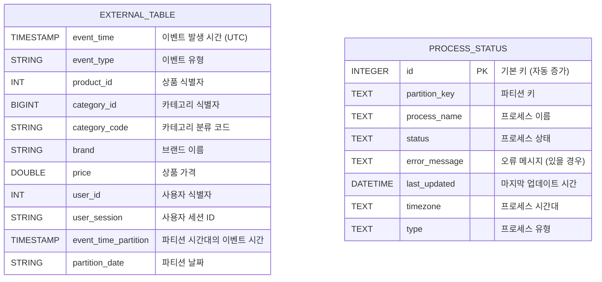

# Backpacker-Challenge

### 과제 요구사항

아래 사용자 activity 로그를 Hive table 로 제공하기 위한 Spark Application 을 작성하세요 

https://www.kaggle.com/mkechinov/ecommerce-behavior-data-from-multi-category-store

2019-Nov.csv,  2019-Oct.csv

- KST 기준 daily partition 처리
- 재처리 후 parquet, snappy 처리
- External Table 방식으로 설계
- 추가 기간 처리에 대응가능하도록 구현
- 배치 장애시 복구를 위한 장치 구현

Spark Application 구현에 사용가능한 언어는 **Scala나 Java**로 제한합니다.

File Path를 포함하여 제출시 특정할 수 없는 정보는 모두 임의로 작성해주세요.

---

### 기술 스택

- **Java 17**
    - 프로젝트 요구 사항 및 과제 기간이 제한적인 점을 고려하여 Scala 대신 익숙한 Java를 선택하였습니다.
    - Spark의 최신 버전을 지원하는 가장 안정적인 LTS 버전이라 판단하여 선택하게 되었습니다.
- **Apache Spark 3.4.1**
- **SQLite**
    - 프로젝트 상태 관리와 프로세스 실패 복구 로직을 위해 사용되었습니다.

---

### 실행 방법

1. 프로젝트 클론

```
$ git clone https://github.com/barabobBOB/Backpacker-Challenge.git
$ cd Backpacker-Challenge
```

1. **`src/main/resources/config.yml`** 설정

```yaml
database:
  url: "jdbc:sqlite:process_status.db"

app:
  timezone: "Asia/Seoul"
  startMonth: "2019-Oct"
  endMonth: "2019-Nov"
  inputPath: "/Users/choeseyeon/Documents/Backpacker-Challenge/data/input/"
  outputPath: "/Users/choeseyeon/Documents/Backpacker-Challenge/spark-warehouse/data/partitions/"
  partition: "DAY"
  derbyPath: "/Users/choeseyeon/Documents/Backpacker-Challenge/metastore_db"
  retryFailed: false
```

**database**

- url
    - SQLite 데이터베이스의 URL입니다.
    - 현재 상태 관리 테이블은 process_status.db 파일로 저장됩니다.

**app**

- timezone
    - 애플리케이션에서 사용할 시간대를 지정합니다.
    - 현재 설정된 값은 Asia/Seoul로, 모든 시간대 관련 작업은 해당 타임존을 기준으로 수행됩니다.
- startMonth
    - 데이터 처리의 시작 월을 지정합니다.
    - e.g. 2019-Oct (2019년 10월)
- endMonth
    - 데이터 처리의 종료 월을 지정합니다.
    - e.g. 2019-Nov (2019년 11월)
- inputPath
    - 처리할 데이터 파일이 위치한 디렉토리 경로를 지정합니다.
    - e.g. `/Users/choeseyeon/Documents/Backpacker-Challenge/data/input/`
- outputPath
    - 처리된 데이터가 저장될 디렉토리 경로를 지정합니다.
    - 데이터는 파티션별로 분류되어 저장됩니다.
    - e.g. `/Users/choeseyeon/Documents/Backpacker-Challenge/spark-warehouse/data/partitions/`
- partition
    - 데이터를 파티션하는 기준을 지정합니다.
    - 현재 설정은 DAY로, 일 단위로 데이터가 파티셔닝됩니다.
    - `YEAR, MONTH, DAY, HOUR, MINUTE, SECOND` 를 지원합니다.
- derbyPath
    - Hive 메타스토어로 사용되는 Derby 데이터베이스의 경로를 지정합니다.
    - e.g. `/Users/choeseyeon/Documents/Backpacker-Challenge/metastore_db`
- retryFailed
    - 이전에 실패한 데이터를 다시 처리할지 여부를 설정합니다.
    - true: 실패한 데이터에 대해 재처리를 시도합니다.
    - false: 실패한 데이터 재처리 없이 새로운 데이터만 처리합니다.

1. 파일 설정
- **`./data/input`** 위치에 **`{년도}-{월(e.g. Oct, Nov)}`** 형식의 파일명을 가진 csv 파일을 업로드합니다.

1. 실행
- 프로젝트 루트 디렉토리 위치에서 실행합니다.

```
$ mvn clean install

$ java \
  --add-opens java.base/sun.nio.ch=ALL-UNNAMED \
  --add-opens java.base/java.net=ALL-UNNAMED \
  -cp Backpacker-Challenge.main \
  com.project.app.Main
```

- (참고) 인텔리제이 실행 방법
    
    

    

---

### 폴더 구조

```
├── README.md
├── build.gradle
├── data
│   └── input ✅ **처리할 데이터 위치** / 형식은 {년도}-{월(e.g. Oct, Nov)}
│       ├── 2019-Nov.csv
│       └── 2019-Oct.csv
├── derby.log
├── gradle
│   └── ...
├── gradlew
├── gradlew.bat
├── identifier.sqlite
├── metastore_db ✅ **Hive 메타스토어 데이터베이스 / External Table 명세**
│   └── ...
├── process_status.db ✅ **상태 관리 테이블**
├── settings.gradle
├── spark-warehouse ✅ **처리한 파티셔닝 데이터 저장 위치**
│   └── data
│       └── partitions
│           └── Asia
│               └── Seoul
│                   └── day
│                       └── ...
└── src
	└── main
	    ├── java
	    │   └── com
	    │       └── project
	    │           ├── app ✅ **메인 실행 클래스 및 엔트리포인트**
	    │           │   └── Main.java ✅ **애플리케이션 진입점**
	    │           ├── config ✅ **설정 파일 로드 및 관리**
	    │           │   └── ConfigLoader.java ✅ **YAML 설정 로더**
	    │           ├── database ✅ **데이터베이스 연결 및 상태 관리**
	    │           │   ├── DatabaseConnection.java ✅ **데이터베이스 연결 객체 생성**
	    │           │   └── ProcessStatusRepository.java ✅ **프로세스 상태 관리 레포지토리**
	    │           ├── entity ✅ **데이터 모델 클래스 정의**
	    │           │   └── ProcessStatus.java ✅ **프로세스 상태 엔티티 클래스**
	    │           ├── hive ✅ **Hive 관련 작업 클래스**
	    │           │   ├── HiveTableManager.java ✅ **Hive External Table 및 파티션 관리**
	    │           │   └── PartitionManager.java ✅ **Spark 파티셔닝 로직 관리**
	    │           └── utils ✅ **유틸리티 클래스 모음**
	    │               ├── Month.java ✅ **월 단위 처리 관련 유틸리티**
	    │               ├── Status.java ✅ **프로세스 상태 열거형**
	    │               ├── TimePartition.java ✅ **파티셔닝 타입 정의 및 관리**
	    │               └── Type.java ✅ **프로세스 타입 열거형**
	    └── resources
		├── config.yml ✅ **애플리케이션 설정 파일**
		└── log4j2.xml ✅ **로그 설정 파일**
```

---

### ERD



---

### 구현

- KST 기준 daily partition 처리
    - 지정한 타임존(timezone)이 KST(Asia/Seoul)이고 지정한 파티션 기준이 DAY라고 가정하면, `from_utc_timestamp` 함수를 사용해 UTC 시간에서 KST로 변환한 뒤, `yyyy-MM-dd` 형식의 일간 파티션을 생성합니다.
- 재처리 후 parquet, snappy 처리
    

    
- External Table 방식으로 설계
    - 새로운 파티션(디렉터리)이 생성될 때마다 Hive 테이블 메타스토어에 자동으로 인식시키기 위해 동적 파티션 옵션을 활성화 시켰습니다.
    - 저장된 Parquet 파일을 Hive에서 바로 스키마 on read 방식으로 조회할 수 있도록 합니다.
    - `MSCK REPAIR TABLE` 문을 실행해 새로운 파티션을 Hive 메타스토어에 인식시킵니다.
- 추가 기간 처리에 대응가능하도록 구현
    - 원하는 시작 월(`startMonth`)부터 끝 월(`endMonth`)까지의 모든 월을 동적으로 생성할 수 있습니다.
    - `startMonth`, `endMonth` 인자를 `config.yml`을 통해 설정하면, 프로젝트가 실행될 때 자동으로 대상 기간이 계산되어 처리됩니다.
    - 기존에 처리된 기간뿐 아니라, 새롭게 필요한 기간이 생기더라도 `config.yml` 수정만으로 쉽게 추가 처리를 할 수 있습니다.
- 배치 장애시 복구를 위한 장치 구현
    - `process_status` 테이블을 두고, 각 월별 파일과 Hive 수준의 문제 등 다양한 조건의 성공/실패 상태를 기록합니다.
    - `src/main/resources/config.yml` 에서 app.retryFailed 옵션을 true 할 경우, 재처리 로직이 실행됩니다.
    - Hive 수준의 문제(테이블 또는 파티션 관리 오류) 발생 시, 재시도 후, 실패하면 오류를 기록하고 알림을 보낼 수 있도록 확장 지점이 마련되어 있습니다.
